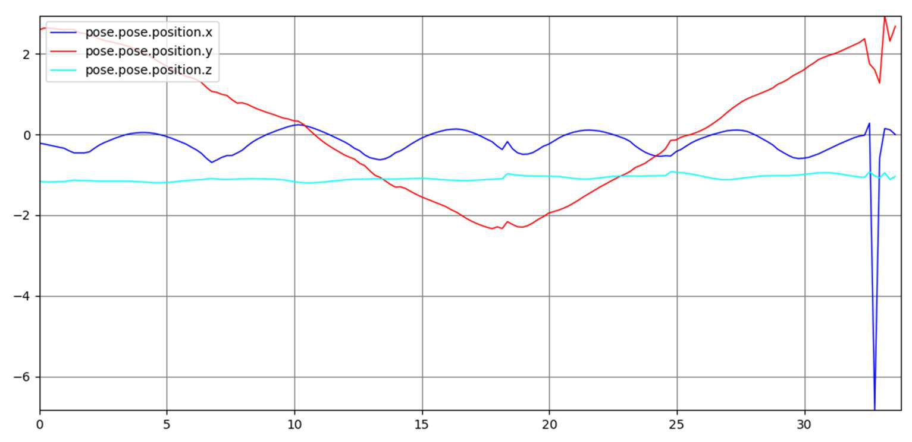

# Drone Perception & State Estimation

ROS/C++ project covering camera pose estimation, stereo visual odometry and IMU/vision sensor fusion with an Extended Kalman Filter.

The project progressed from vision-based pose estimation to stereo odometry and sensor fusion, ending with an experimental augmented EKF integration.


<p align="center">
  
</p>

## Overview

The project was developed in four stages:

**Planar pose estimation → Stereo visual odometry → IMU + vision EKF → Augmented EKF integration**

Main topics covered:

- Computer vision and feature tracking
- Stereo visual odometry
- PnP pose estimation
- IMU/camera sensor fusion
- Extended Kalman Filters
- Coordinate-frame transformations
- ROS visualization and integration

## Planar Camera Pose Estimation

The first stage estimated camera pose from a planar fiducial board.

I implemented a pose estimation method using:

- 2D-3D marker correspondences
- planar homography estimation with DLT
- SVD
- camera intrinsics
- homography decomposition
- rotation orthogonalization
- translation recovery

The result was compared against an OpenCV `solvePnP` implementation provided as a reference.

## Stereo Visual Odometry

The stereo visual odometry pipeline was implemented on top of a provided ROS skeleton.

The main pipeline was:

```text
Stereo images
    ↓
Shi-Tomasi feature detection
    ↓
Lucas-Kanade feature tracking
    ↓
RANSAC geometric filtering
    ↓
Stereo 3D points
    ↓
Temporal feature tracking
    ↓
PnP-RANSAC
    ↓
Relative pose and trajectory
```

I worked on the main processing flow, feature detection and tracking, geometric filtering, relative pose estimation and keyframe logic.

The 3D point generation and image undistortion functions were provided as part of the project skeleton.

The estimated odometry, path and point cloud were published through ROS and visualized in RViz.

<p align="center">
  
</p>

<p align="center">
  <em>Stereo feature tracking.</em>
</p>

## IMU + Vision EKF

The next stage fused IMU measurements with pose estimates from the fiducial detector using a 15-state Extended Kalman Filter.

The state vector contained:

```text
[position, orientation, velocity, gyroscope bias, accelerometer bias]
```

The implementation included:

- IMU-based nonlinear prediction
- covariance propagation
- camera-to-IMU coordinate transformations
- position and orientation measurement updates
- Kalman gain computation
- gyroscope and accelerometer bias states
- angle wrapping
- ROS odometry publishing

This part introduced multi-rate sensor fusion between high-frequency IMU data and lower-frequency camera measurements.

<p align="center">
  
</p>

<p align="center">
  <em>EKF estimate in red and tag-based odometry in blue.</em>
</p>

## Experimental Augmented EKF

The final stage explored a 21-state EKF combining:

- IMU prediction
- absolute marker/PnP measurements
- relative stereo visual odometry
- an augmented keyframe pose

The final integration was not reliable across all datasets and did not initialize correctly during one of the laboratory tests.

After debugging the initialization and sensor flow, we decided not to deploy the estimator on the real robot without a reliable result.

This stage is included as experimental integration work rather than a finished estimator.

## Results

### Stereo Visual Odometry

<p align="center">
  
</p>

### IMU + Vision EKF

<p align="center">
  
</p>

<p align="center">
  
</p>

## Technologies

`C++` · `ROS` · `OpenCV` · `Eigen` · `Stereo Vision` · `Visual Odometry` · `Extended Kalman Filter` · `RViz` · `rqt`
