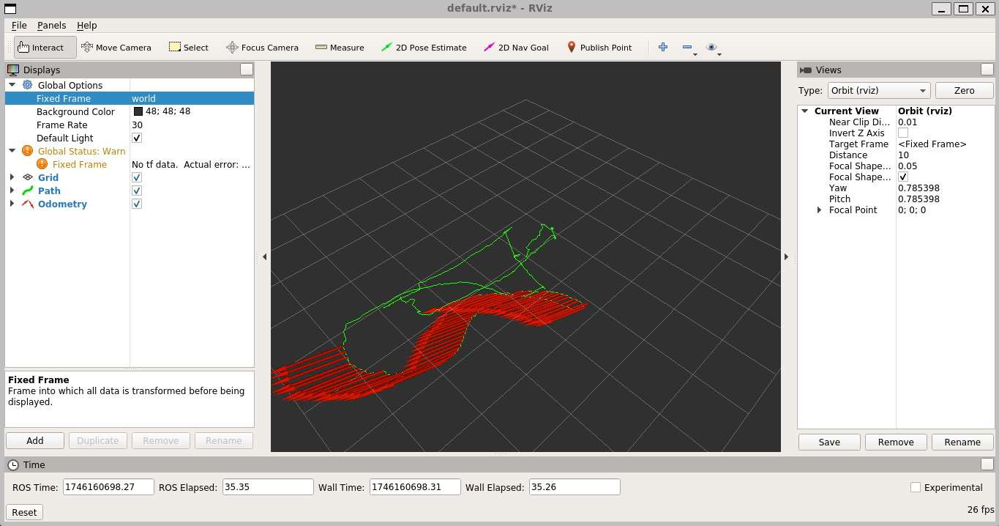
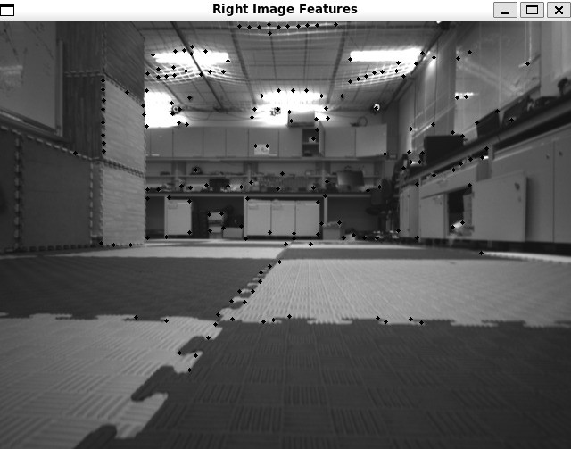
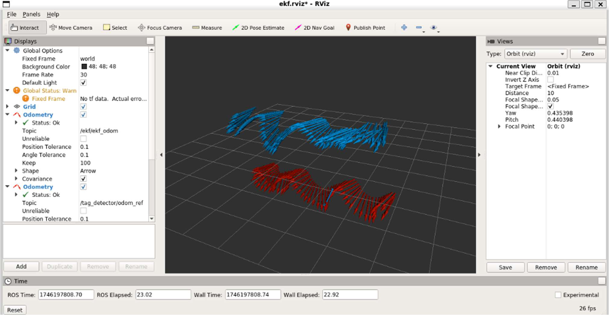
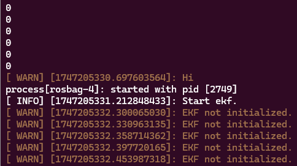

# Drone Perception & State Estimation

Recovered **ROS 1 / C++ robotics perception and state-estimation** work progressing from planar fiducial pose estimation and stereo visual odometry to a 15-state IMU/vision EKF, followed by an experimental 21-state augmented EKF integration.


> **Recovery status:** this is a technical case study built from surviving source files and preserved results. The original ROS workspace, headers, launch/configuration files, custom messages and datasets are incomplete, so this repository is **not advertised as directly buildable or reproducible**.

<p align="center">
  
</p>
<p align="center"><em>Stereo visual odometry trajectory recovered from the project report: odometry poses in red and accumulated path in green.</em></p>

## Project overview

The work evolved through four stages:


| Stage | Main technical focus | Recovery status |
|---|---|---|
| Planar pose | Planar DLT/homography pose recovery, SVD, camera intrinsics, rotation orthogonalization | Recovered source |
| Stereo VO | Shi-Tomasi features, LK tracking, geometric filtering, stereo 3D points, PnP-RANSAC, keyframes | Recovered mixed skeleton/completed source + results |
| IMU + vision EKF | Multi-rate IMU prediction and camera/tag pose correction with a 15-state filter | Recovered individual-project source + results |
| Augmented EKF | IMU + absolute PnP + relative stereo VO with an augmented keyframe pose | **Experimental/incomplete**, recovered source + failure evidence |

For provenance and authorship boundaries, see [SOURCE_RECOVERY.md](SOURCE_RECOVERY.md).

## 1. Planar camera pose estimation

**Problem.** Estimate camera pose from 2D image corners of a planar fiducial board with known 3D marker geometry.

The recovered node contains two paths inside the same processing function: an OpenCV `solvePnP` path explicitly labelled in the source as a **reference**, and a separate block labelled **"your work"**. The student-work block:

- undistorts the observed marker corners while retaining pixel coordinates through the camera matrix,
- builds the planar DLT system for a 3x3 homography from world-plane `(X,Y,1)` to image coordinates,
- solves the homogeneous system using Eigen SVD,
- applies `K^-1` to the homography,
- forms a rotation candidate from the first two homography columns and their cross product,
- projects that candidate onto an orthogonal matrix using a second SVD,
- scales the third homography column to recover translation,
- compares the resulting rotation/translation numerically with the OpenCV `solvePnP` reference.

The recovered comparison uses matrix/vector norms rather than a calibrated ground-truth error metric. A code-review note about the running-average counter is documented in [docs/architecture.md](docs/architecture.md).

## 2. Stereo visual odometry

The stereo VO assignment started from a course-provided ROS skeleton. The assignment explicitly required completion of the main processing flow, feature detection, stereo and temporal feature tracking, relative PnP pose estimation, and latest-state updates. It also explicitly states that **`generate3dPoints` and `undistortedPts` were provided**, so their presence in the recovered file is not presented as a from-scratch implementation.

Recovered processing flow:

```text
stereo images
  -> Shi-Tomasi feature detection
  -> left/right Lucas-Kanade tracking
  -> fundamental-matrix RANSAC filtering
  -> stereo 3D points
  -> keyframe-to-current temporal tracking
  -> geometric filtering
  -> PnP-RANSAC relative pose
  -> world-frame trajectory accumulation
  -> ROS odometry / path / point-cloud publication
```

Verified parameters in the surviving source include 180 Shi-Tomasi features, quality level `0.015`, minimum spacing `9`, a `27x27` LK window for left/right tracking, a `19x19` LK window for temporal tracking, and PnP-RANSAC with 150 iterations and 0.98 confidence. The PnP call uses **normalized image coordinates with an identity intrinsic matrix**, so the source's `3.0` reprojection threshold should not be described as a verified 3-pixel threshold.

The submitted report records keyframe thresholds of 0.1 m translation, 0.1 rad rotation and 20 tracked points; the YAML file that originally supplied these values is not available in the recovery set.

<p align="center">
  
</p>
<p align="center"><em>Recovered right-camera feature visualization from the stereo VO run.</em></p>

## 3. IMU + vision EKF

This phase was specified as an **individual project** completed inside a provided EKF ROS skeleton. The recovered implementation fuses high-rate IMU measurements with lower-rate pose measurements from the tag detector and publishes `nav_msgs/Odometry`.

The 15-state vector used by the source is:

| Indices | State |
|---|---|
| 0-2 | 3D position |
| 3-5 | Euler orientation `(roll, pitch, yaw)` |
| 6-8 | 3D velocity |
| 9-11 | gyroscope bias |
| 12-14 | accelerometer bias |

The IMU callback performs nonlinear state prediction and covariance propagation from accelerometer/gyroscope data. The camera/tag callback converts the recovered camera pose into the IMU/world convention using the fixed camera-to-IMU transform supplied in the project code, forms a 6D position/orientation measurement, wraps angular innovations and applies the Kalman correction. The source also maintains gyro and accelerometer bias states and publishes filtered pose and linear velocity.

The course specification describes a 400 Hz IMU stream and 20 Hz image stream, which makes the stage a useful example of multi-rate sensor fusion. The preserved plots are **qualitative evidence only**; no ground-truth error metric was recovered, so this repository does not claim a measured accuracy improvement.

<p align="center">
  
</p>
<p align="center"><em>Recovered RViz comparison: EKF odometry in red and tag-detector odometry in blue.</em></p>

## 4. Experimental augmented EKF

A later integration attempted to extend the filter to **21 states** by combining:

- the current 15-state IMU-driven state,
- absolute 6D marker/PnP pose updates,
- relative 6D stereo-VO updates,
- a 6D augmented keyframe pose used by the relative measurement model.

This stage is intentionally presented as **experimental and incomplete**. The recovered report shows inconsistent trajectories on one dataset and repeated `EKF not initialized.` messages on the laboratory bag. The same report includes OptiTrack position data indicating that the physical recorded motion itself was not obviously pathological, and the team chose not to deploy the unreliable estimator on the real robot because of crash risk.

**Observed problem -> Evidence -> Investigation -> Technical hypothesis -> Unresolved aspects -> Engineering decision**

- **Observed problem:** unreliable fused trajectories; on the lab bag the filter remained uninitialized during the captured interval.
- **Evidence:** RViz divergence, terminal output with repeated initialization warnings, and separate OptiTrack trajectory plots.
- **Investigation:** the recovered filter gates both IMU and VO processing on `init_`; initialization can only complete after a valid PnP/tag-odometry callback.
- **Technical hypothesis:** the lab symptom is consistent with the filter not receiving/accepting a usable PnP initialization measurement during the logged interval. Later trajectory instability also has several suspicious code paths identified in post-project review.
- **Unresolved aspects:** the original bag, topic graph, headers, launch files and exact workspace revision are missing, so a definitive root cause cannot be established.
- **Engineering decision:** hardware testing was stopped rather than risking a robot crash with an estimator that had not been validated reliably.

See the detailed, evidence-separated analysis in [docs/failure_analysis.md](docs/failure_analysis.md).

<p align="center">
  
</p>
<p align="center"><em>Captured laboratory-bag symptom: IMU/VO callbacks repeatedly report that the EKF is not initialized.</em></p>

## Results

| Evidence | Recovered result |
|---|---|
| Stereo VO | [RViz trajectory](media/stereo_vo/trajectory_rviz.png), [tracked features](media/stereo_vo/stereo_features.png) |
| 15-state EKF | [orientation plot](media/ekf/orientation_rqt.png), [position plot](media/ekf/position_rqt.png), [velocity plot](media/ekf/velocity_rqt.png), [RViz comparison](media/ekf/ekf_vs_tag_rviz.png) |
| Augmented EKF | [first dataset RViz](media/augmented_ekf/first_dataset_rviz.png), [lab dataset RViz](media/augmented_ekf/lab_dataset_rviz.png), [initializing-run terminal](media/augmented_ekf/initializing_run_terminal.png), [not-initialized terminal](media/augmented_ekf/not_initialized_terminal.png), [OptiTrack position](media/augmented_ekf/optitrack_position.png) |

## Limitations

- The original ROS workspace is incomplete: headers, build metadata, launch files, YAML/calibration files, custom message definitions and datasets are missing.
- The stereo VO file is mixed-provenance skeleton/completed code; the assignment explicitly identifies 3D point generation and undistortion as provided functionality.
- The EKF phase was completed in a provided skeleton rather than written as an entire package from scratch.
- The augmented EKF was a later team integration; the surviving artifacts do not establish per-file authorship and the final integration was not successfully validated.
- No reliable quantitative ground-truth error metric survives for the planar, stereo-VO or 15-state-EKF stages.
- Post-recovery code review found implementation details that should be treated as limitations rather than silently corrected; they are documented in the technical notes.

## Recovered source

The repository contains eight unique recovered `.cpp` files, renamed by role and preserved without algorithmic fixes. The most important missing components are the associated headers, ROS package/build files, custom message definitions, configuration/calibration files and datasets.

See [SOURCE_RECOVERY.md](SOURCE_RECOVERY.md) for the exact original-to-repository mapping and provenance notes.

## Key takeaways

- Implemented and debugged core perception primitives around planar geometry, feature tracking, PnP and trajectory estimation.
- Worked with multi-rate IMU/camera fusion, covariance propagation, sensor biases and coordinate-frame transformations.
- Worked with ROS odometry, path and point-cloud publication for visualization and downstream integration.
- Used qualitative plots, RViz, terminal logs and cross-dataset checks to investigate estimator behaviour.
- Treated failed integration as an engineering result: documented uncertainty, separated evidence from hypotheses, and stopped unsafe hardware deployment.
