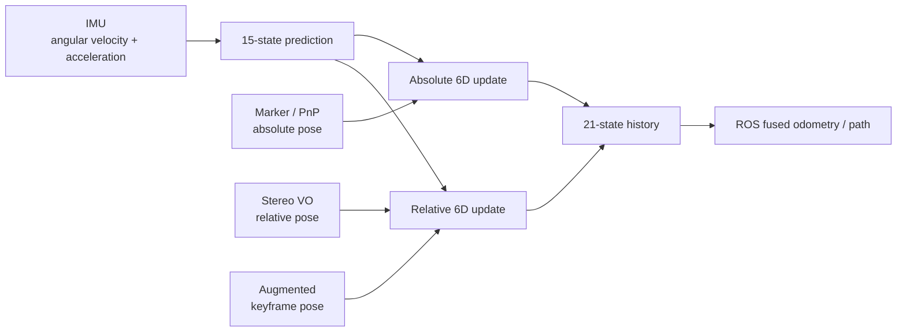
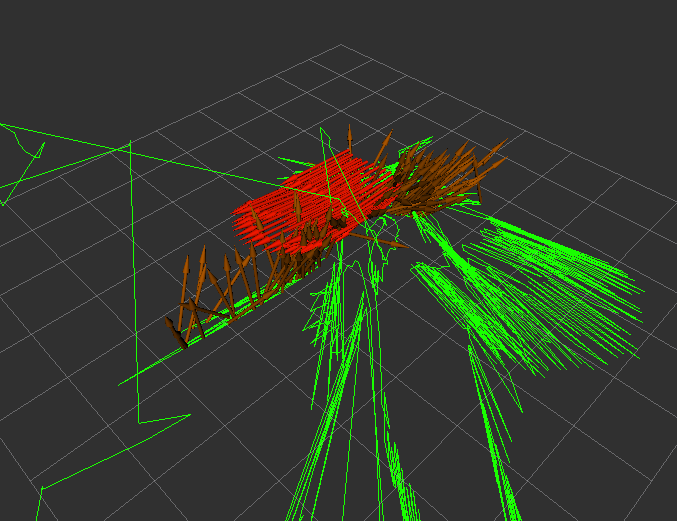
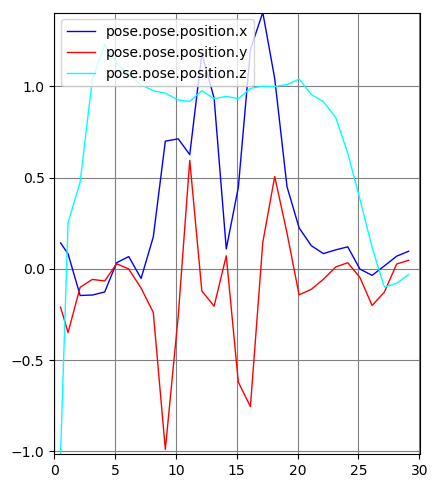

# Experimental augmented EKF: failure analysis

This document separates **observed evidence** from **post-project hypotheses**. The original bags, full ROS graph, headers, launch files and exact workspace revision are unavailable, so it does not claim a definitive root cause.

## Intended measurement flow



The 21-state representation is the original 15-state IMU model plus a 6D augmented keyframe pose. The code keeps timestamped states in a deque and attempts to insert delayed measurements and repropagate later states.

## Observed problem

Two distinct failure modes are visible in the recovered report:

1. A provided/earlier augmented-EKF bag ran through updates but produced a trajectory the report itself described as wrong.
2. The laboratory-recorded bag produced worse behaviour; the captured terminal repeatedly printed `EKF not initialized.` after the node started.

<p align="center">
  
</p>

The lab RViz capture shows the augmented EKF, camera/tag EKF and VO path diverging substantially rather than forming one consistent trajectory.

## Evidence

### 1. Initialization warnings

<p align="center">
  
</p>

The filter's `imuCallback` and `stereoVOCallback` both begin with:

```cpp
if(!init_){
  ROS_WARN("EKF not initialized.");
  return;
}
```

Therefore the captured warnings mean those messages were arriving while `init_` was still false.

### 2. Initialization can only be completed by PnP

`init_` is explicitly set to false during initialization. In the recovered code, the only path that changes it to true is the first accepted `PnPCallback`:

```text
PnP callback received
  -> reject selected NaN values
  -> reject a pose whose x,y,z are all approximately zero
  -> insert PnP state
  -> initUsingPnP(...)
  -> init_ = true
  -> augment current pose as keyframe
```

`initUsingPnP` itself requires the state type to be `pnp`; if so, it performs a PnP update from a zero 21-state prior with `0.8 I` covariance and returns true.

This means IMU and VO alone cannot initialize the recovered filter.

### 3. The captured lab log is consistent with no PnP callback in that interval

The node prints `Hi` during its setup. The first line of `PnPCallback` prints `Hi again` before the PnP validity tests. In the recovered laboratory terminal screenshot, `Hi` is visible followed by `Start ekf.` and repeated `EKF not initialized.` messages, while `Hi again` is not visible in the captured interval.

That is **consistent with** the PnP callback not being reached during the part of execution shown. It does not prove that no PnP message existed anywhere in the entire bag.

Possible explanations compatible with the recovered evidence include:

- a topic or namespace mismatch around `tag_odom`,
- no PnP/tag message being published early enough in the logged interval,
- messages rejected as the all-near-zero "PnP lost" condition,
- invalid measurements,
- startup/message-order differences between datasets.

The missing bag and launch files prevent distinguishing these possibilities.

### 4. OptiTrack evidence

<p align="center">
  
</p>

The final report includes an OptiTrack position plot from the laboratory recording and argues that the physical recorded trajectory itself appeared reasonable. This does not validate every ROS topic in the bag, but it is evidence against the simple explanation that the robot's physical motion alone caused the estimator failure.

## Investigation

The recovered code was reviewed after the project specifically to identify conditions that could explain either the initialization symptom or the later inconsistent trajectories. The following points are **post-project code-review observations**, not claims that they were proven root causes during the original experiment.

### A. Nonlinear VO innovation does not use the computed nonlinear prediction

`updateVO` computes:

```cpp
predicted_measurement = modelG2(prev_state.mean, measurement_noise_sample);
```

but the innovation is then formed as:

```cpp
innovation = cur_state.ut - measurement_jacobian * prev_state.mean;
```

For a nonlinear relative-pose measurement model, the standard EKF residual is `z - h(x)`, while `H` is used to linearize the update. Here the code computes `h(x)` but does not use it in the residual. This is a strong candidate for inconsistent VO corrections **after initialization**, but it cannot explain warnings that occur while `init_` is still false.

### B. Keyframe search dereferences an `end()` iterator

The VO callback initializes:

```cpp
deque<AugState>::iterator keyframe_it = aug_state_hist_.end();
```

and then tests `keyframe_it->time_stamp` in the `while` condition before decrementing. Dereferencing `end()` is invalid C++ iterator use. Depending on execution path, this could cause undefined behaviour during keyframe changes.

### C. Motion-model Jacobian appears inconsistent with the acceleration dynamics

The velocity dynamics are:

```text
v_dot = gravity + R(euler) * (accel - accel_bias - noise)
```

but the recovered `jacobiFx` fills the velocity-vs-orientation block with `R * skew(angular_velocity)`. The accelerometer input is read in that function but not used in that block. Since the derivative of the acceleration term with respect to orientation should depend on the transformed specific force, this is suspicious and could corrupt covariance propagation.

### D. Euler wrapping is applied to derivatives in the augmented model

`modelF` wraps the three components of `euler_dot` with `atan2(sin(.), cos(.))` before integration. Wrapping the angular state is common; wrapping an angular-rate derivative is not equivalent. The augmented prediction function also does not visibly wrap the integrated Euler state afterward.

### E. IMU callback publishes a measurement-indexed state rather than the newest propagated IMU state

After predicting the newest IMU state, the callback chooses:

```cpp
x = aug_state_hist_.at(max(latest_idx[pnp], latest_idx[vo])).mean;
```

for publication. That selects whichever PnP/VO measurement index is later, not necessarily the just-propagated IMU state. This could make the nominal high-rate output stale between measurement updates.

### F. Gravity/frame sign differs from the earlier EKF stage

The individual 15-state EKF source uses gravity `(0, 0, +9.80665)`, consistent with the course note that the relevant world `Z` axis points down. The later augmented motion model instead uses `(0, 0, -9.81)`. A frame convention may have changed elsewhere in missing code, so this is **not proof of an error**, but the sign change is a concrete convention mismatch worth checking in any reconstruction.

### G. Integration stubs remain

`processNewState` contains its intended algorithm only as commented steps and returns `true`; `initFilter` returns `false`. Other callbacks contain duplicated direct processing around these stubs. This is consistent with an integration that was still under development.

### H. Stereo relative-pose recovery is incomplete

The recovered stereo ROS node publishes a custom relative-pose message from estimator members named `rel_key_time`, `latest_rel_Q` and `latest_rel_P`. The recovered estimator `.cpp` does not assign those members. This may be missing code or a revision mismatch, but it means the recovered VO-to-augmented-EKF interface cannot be verified end to end.

## Technical hypotheses

The evidence supports two different levels of hypothesis:

**Initialization hypothesis (stronger, but still not proven):** the laboratory run had not received or accepted a usable `tag_odom`/PnP measurement during the captured interval, so `init_` never became true and the IMU/VO callbacks correctly returned early.

**Post-initialization stability hypotheses:** the nonlinear VO residual, iterator handling, Jacobian construction, Euler-rate wrapping, publication indexing and incomplete interface/stub code are plausible contributors to the wrong fused trajectories seen when the filter did initialize.

These issues may coexist. The surviving artifacts do not establish which one dominated the original experiment.

## Unresolved aspects

A definitive diagnosis would require artifacts that are no longer available:

- the exact lab rosbag and earlier `augekf` bag,
- `rostopic info/echo` evidence for `tag_odom` and `/vo/Relative_pose`,
- launch-file namespaces and remappings,
- the missing augmented-EKF headers and type definitions,
- the custom relative-pose message definition,
- the exact stereo estimator revision that populated the relative-pose fields,
- parameter YAML values,
- synchronized comparisons against OptiTrack.

Without these, attributing the failure to one root cause would be speculative.

## Engineering decision / lesson learned

The team did **not** deploy the unreliable estimator on the real robot because the integration had not been validated and a navigation/state-estimation fault could cause a crash. That decision is part of the technical outcome: failed integration should trigger diagnosis and containment, not be hidden by presenting an unvalidated pipeline as working.
